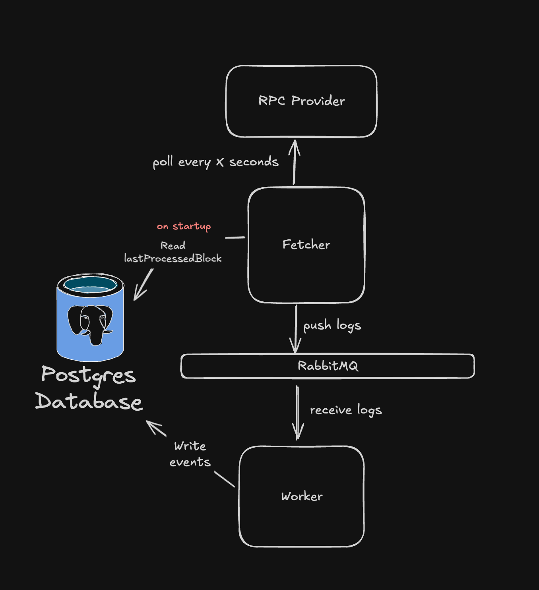
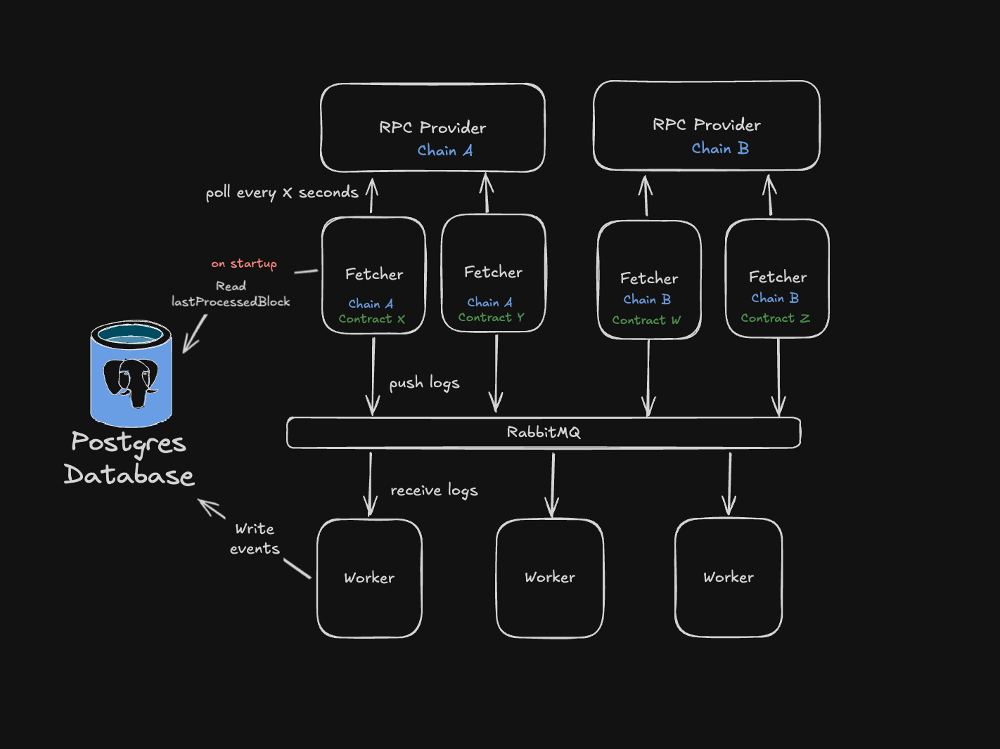

# Real time event monitor

This system is designed to index a single event from multiple chains in real time. 

Keep reading to see how it can be extended to index multiple events from different contracts on multiple chains.

## How to run

Simply run `docker compose up` to start the system.

## Design

The design is based on the following priorities:

- **Flexibility**: 
    - From my experience creating products that seek PMF, the system design and it's data architecture will change overtime, sometimes drastically. 
    - To facilitate design updates, the system should be modular, with components that have a single responsibility and which can be easily updated or replaced.
    - The system should be designed in a way that allows for new table columns to be populated quickly.
- **Scalability**:
    - The system should be able to handle large amounts of data, and scale to meet the demand.
    - The system should be designed in a way that allows for easy horizontal scaling.
- **Recovery**:
    - The system should be able to recover from downtime without skipping new data. 

The system has the following components

**1. Database**

A Postgres database with 2 tables
- Chain - storing chain information like chainId, name, last processed block
- SocketBridgeEvent - storing event data like blockNumber, txHash, chainId, logIndex and event specific data. The combination of chainId_txHash_logIndex is unique per event.

**2. RabbitMQ**

RabbitMQ is used as a message broker to pass data between the different components. It enables the system to scale horizontally, by adding multiple instances of message senders and consumers.

**3. Fetcher**

Polls the RPC periodically for new events from a specific contract on a specific chain. It will fetch batches of events and pass them to RabbitMQ.

The contract address, chain id, batch size, and polling interval are configurable via ENV Vars.

**4. Worker**

Consumes the logs from RabbitMQ, parses them and stores batch of event data in the database 

**5. REST API**

Serves the data to the frontend.

### Current design

Currently, the system is designed to handle indexing a single event type (SocketBridge) from multiple chains. A fetcher needs to be deployed for each chain. 

### Extended design

The current implementation can be easily extended to handle indexing multiple event types from multiple contracts and multiple chains. 

What are the steps to achieve this?
1. [DATABASE] Add a table to for each new event type
2. [FETCHER] Extract the currently hardcoded event signature value into an array passed as ENV variable on start/deployment
3. [WORKER] If multiple workers store events on the same chain in parallel, they should update the lastProcessedBlock only if the new block number is greater than the current lastProcessedBlock stored in the chain table.
